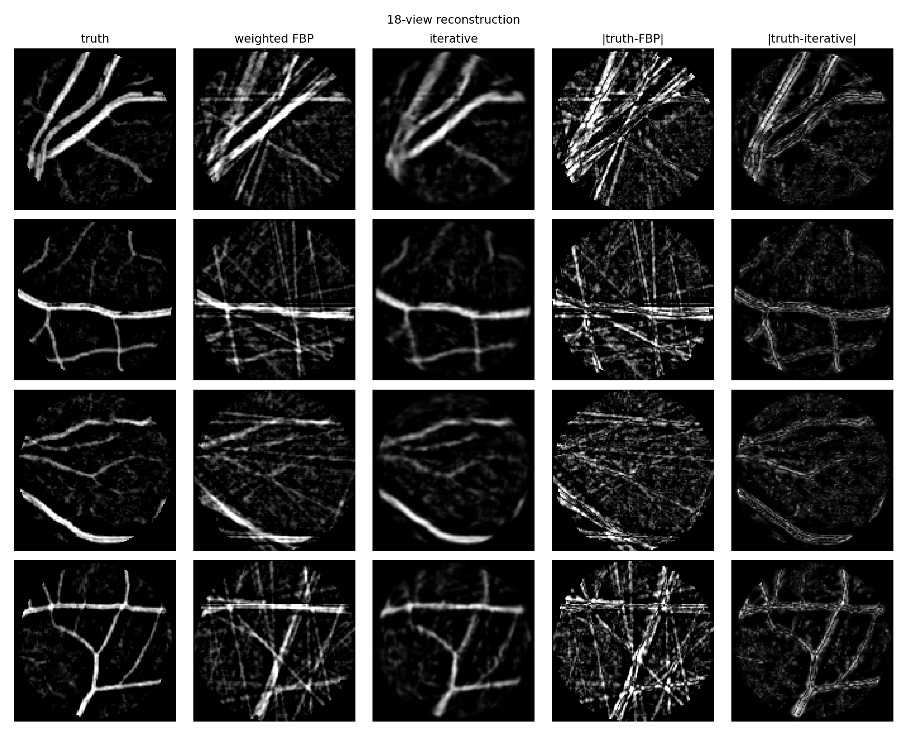
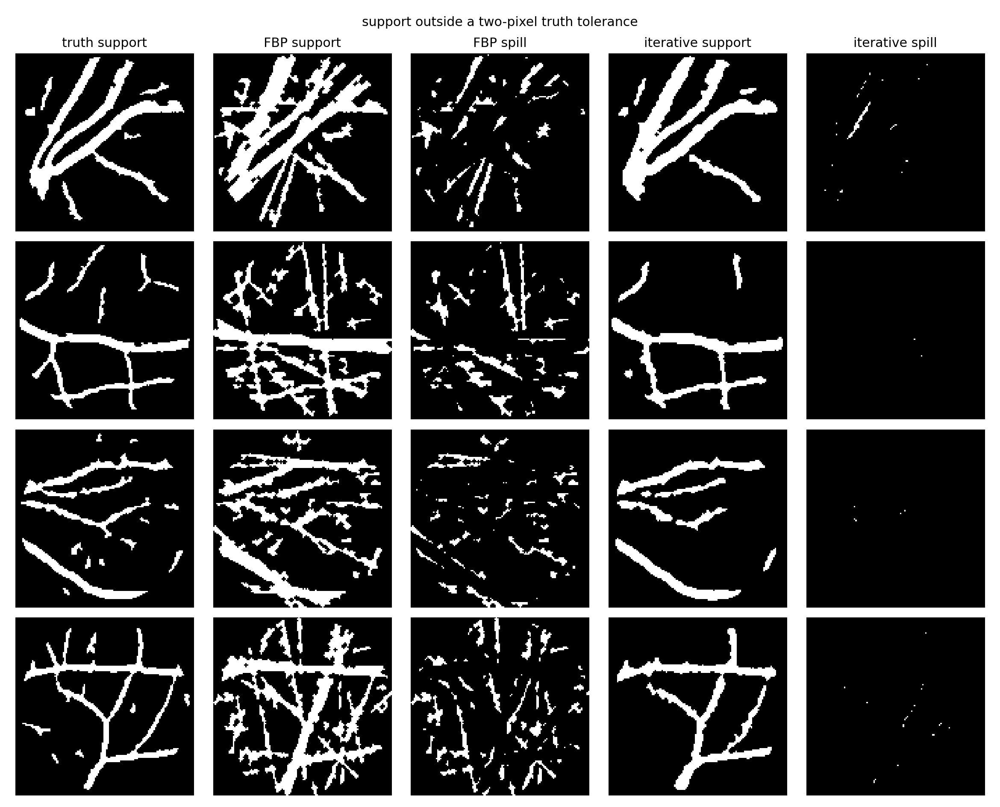

# ridge-tomography

This project measures two sparse-angle retinal tomography failures that PSNR misses: curved ridges becoming straighter and reconstructed vessels continuing beyond true endpoints.

## Charts

## Benchmark

The input is four 128×128 vessel-enhanced crops from `skimage.data.retina`, reconstructed from the same 18 noisy parallel-beam projections.

method | PSNR | SSIM | false skeleton | endpoint overrun | curve RMSE | tangent error | bend correlation
--- | ---: | ---: | ---: | ---: | ---: | ---: | ---:
weighted FBP | 17.77 dB | 0.439 | 501.25 px | 8.63 px | 1.34 px | 16.50° | 0.414
iterative | 23.74 dB | 0.710 | 20.25 px | 1.88 px | 0.92 px | 12.24° | 0.693

The iterative reconstruction uses 200 projected SART sweeps at relaxation 0.15, clips to `[0,1]` after each sweep, then applies Gaussian smoothing with σ = 0.7. The original success threshold is 16.01 dB.

Endpoint probes follow the true outward terminal tangent. Curve probes search each normal cross-section for the reconstructed ridge, then measure localization, tangent error and bend-shape correlation. False skeleton is reconstructed support more than two pixels from the true vessel mask.

## Spec

`spec/RidgeTomography.lean` is the benchmark written as a fixed-point executable specification. `spec/Invariants.lean` proves the endpoint barrier, ridge displacement conversion and positive structural-mass arithmetic over `ℝ`; it uses Mathlib and contains no `sorry`.

Wang and Zahl supply the global tube-union volume estimate motivating the structural-mass term. The local curve and endpoint measurements are separate finite-resolution tomography tests.

## Data

The retinal image is Mikael Häggström, “Medical gallery of Mikael Häggström 2014,” *WikiJournal of Medicine* 1(2), 2014, doi:10.15347/wjm/2014.008. The copy distributed through `skimage.data.retina` is CC0.

Hong Wang and Joshua Zahl, “Volume estimates for unions of convex sets, and the Kakeya set conjecture in three dimensions,” arXiv:2502.17655, 2025.

## File map

    src/data.py                 rebuilds the four crops and fixed noisy projections
    src/core.py                 reconstruction and structural measurements
    src/bench.py                writes results/ and reconstruction arrays
    src/figures.py              writes figures/
    spec/RidgeTomography.lean   executable fixed-point benchmark
    spec/Invariants.lean        real-valued certificate consequences
    data/retina.npz             exact crops and selected clean/noisy sinograms
    results/benchmark.json      aggregate benchmark
    results/*.csv               crop, endpoint and curve measurements
    figures/*.png               visual outputs

`make all` reruns the benchmark and figures. `make spec` runs Lean and checks its fixed-point values against `results/benchmark.json`.
